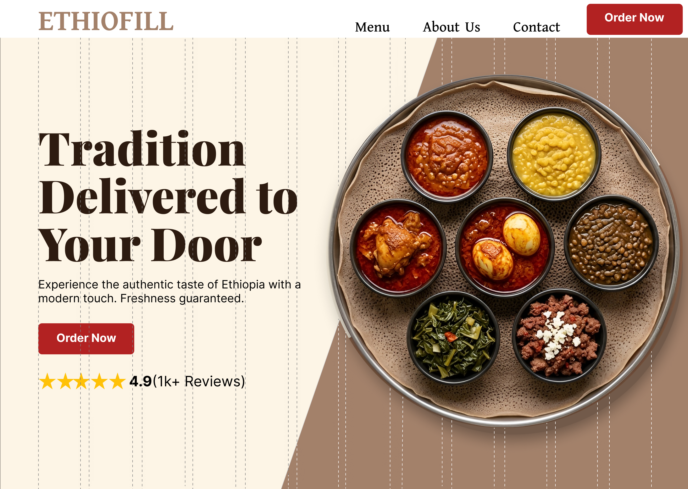

# 🇪🇹 Future Interns | UI/UX Task 2: EthioFill

## 📌 Project Overview
**EthioFill** is a high-conversion UI/UX solution designed to bring Ethiopia’s rich culinary heritage into the modern digital economy. This project focuses on solving the "trust and timing" gap in traditional food delivery for urban professionals.

---

## 👤 User Persona: "Abebe" (The Busy Professional)
* **The Goal:** Wants a healthy, traditional lunch without leaving the office.
* **The Solution:** A simplified 3-tap ordering system with a "CEO-level" professional interface.

---

## 🎨 Visual Identity & Habesha Aesthetic
* **Berbere Red (#E32227):** Primary CTA color to trigger appetite and energy.
* **Teff Brown (#8B4513):** Symbolizing authenticity and grounding the design.
* **12-Column Grid:** A mathematical dashed-line system ensuring professional alignment.

---

## 📂 Internship Details
* **Status:** 🏗️ Task 2 Hero Section Completed
* **Deadline:** May 18th, 2026 (Task 1) | June 1st, 2026 (Final)
* **CIN:** [FIT/MAR26/UX2076]
